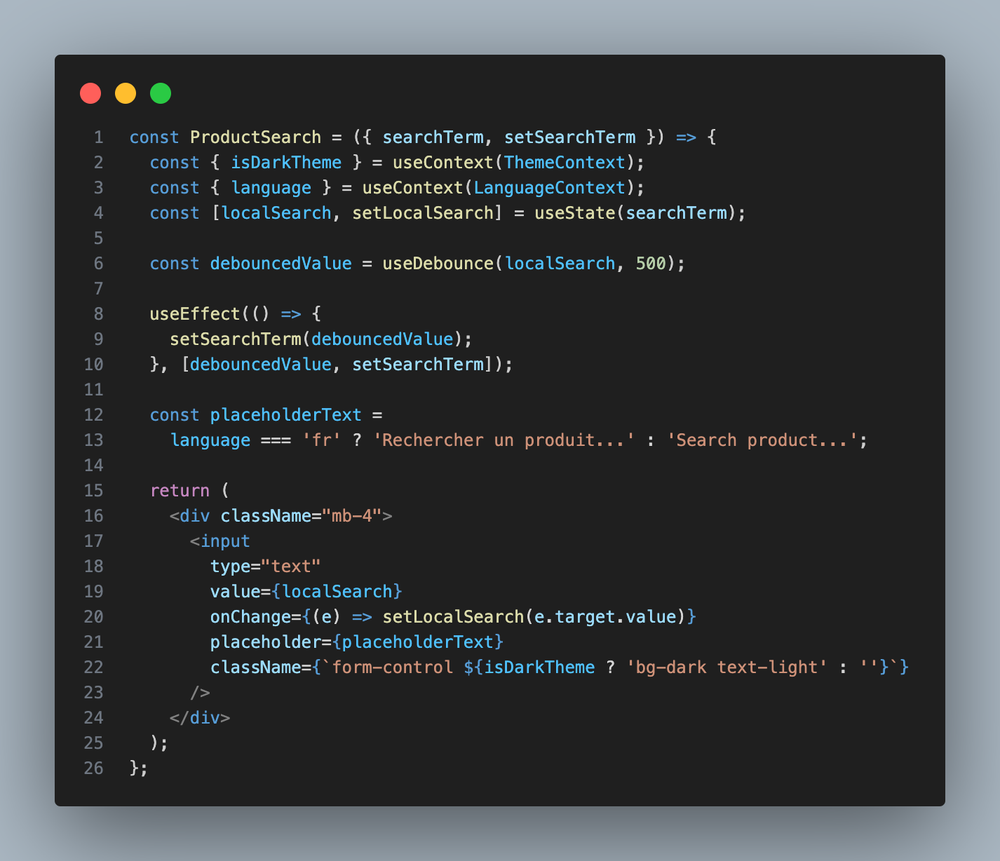
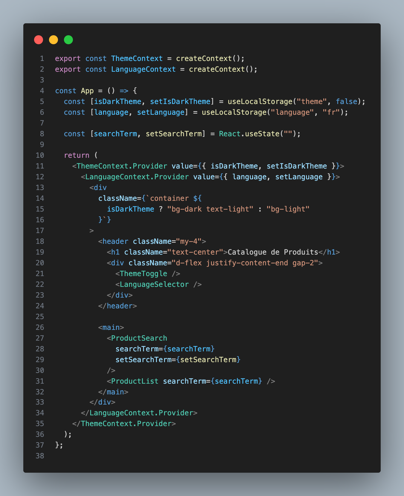
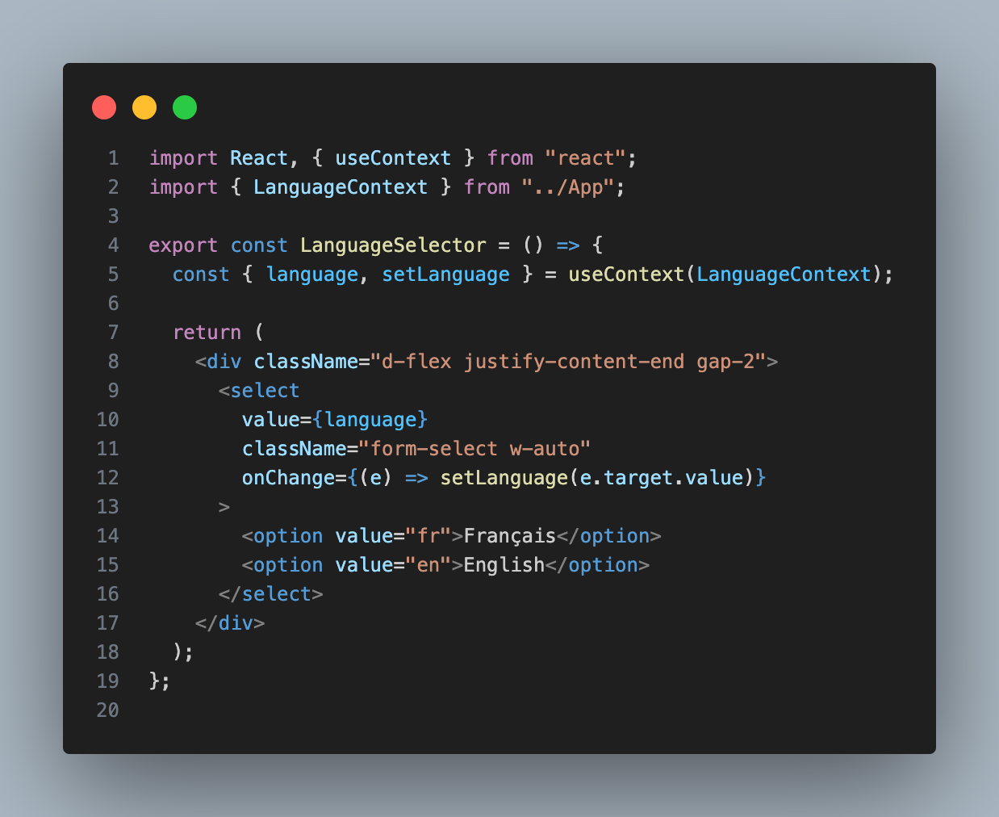
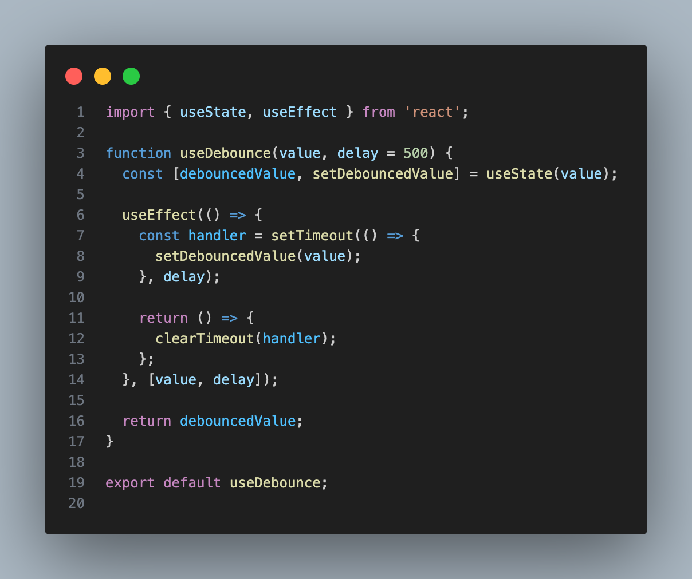
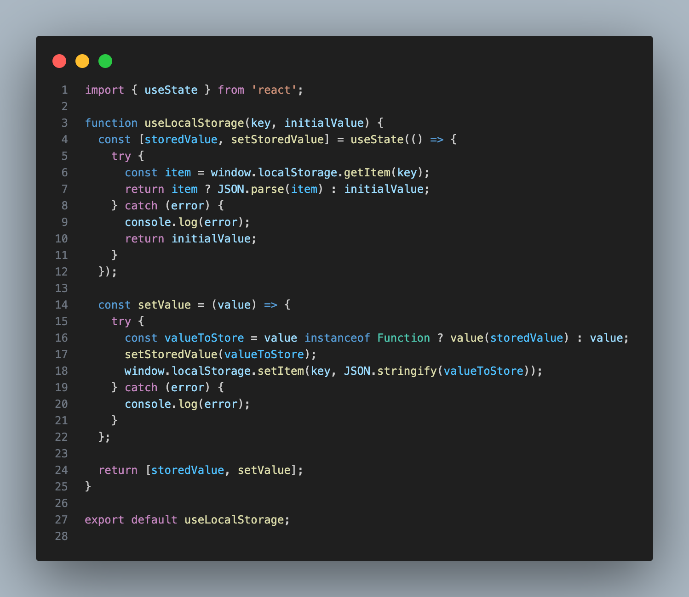
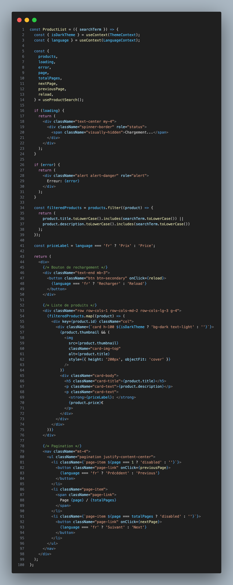
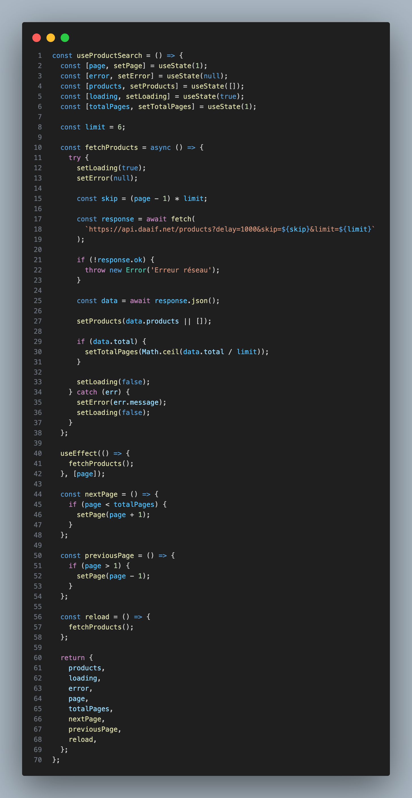

# TP React Hooks - Application de Gestion de Produits

Ce TP a pour objectif de mettre en pratique l'utilisation des Hooks React (**useState**, **useEffect**, **useContext**) ainsi que la création de Hooks personnalisés.

---

## ⚙️ Configuration initiale

### 1️⃣ Installer les dépendances :
```bash
npm install
```

### 2️⃣ Lancer l'application :
```bash
npm start
```

---

## 📌 Instructions pour le TP

Pour chaque exercice :
✅ Lisez attentivement l'énoncé  
✅ Implémentez la solution  
✅ Testez votre implémentation *(pensez à faire des copies d'écran)*  
✅ Mettez à jour la section correspondante dans ce README avec :
   - Une brève explication de votre solution
   - Des captures d'écran montrant le fonctionnement
   - Les difficultés rencontrées et comment vous les avez résolues  
✅ Commitez vos changements avec un message descriptif

---

## 📝 Exercice 1 : État et Effets 
### 🎯 Objectif : Implémenter une recherche en temps réel

- [ ] **1.1** Modifier le composant `ProductSearch` pour utiliser la recherche
- [ ] **1.2** Implémenter le **debounce** sur la recherche
- [ ] **1.3** Documenter votre solution ici



---

## 📝 Exercice 2 : Context et Internationalisation
### 🎯 Objectif : Gérer les préférences de langue

- [ ] **2.1** Créer le `LanguageContext`
- [ ] **2.2** Ajouter le sélecteur de langue
- [ ] **2.3** Documenter votre solution ici




---

## 📝 Exercice 3 : Hooks Personnalisés
### 🎯 Objectif : Créer des hooks réutilisables

- [ ] **3.1** Créer le hook `useDebounce`
- [ ] **3.2** Créer le hook `useLocalStorage`
- [ ] **3.3** Documenter votre solution ici




---

## 📝 Exercice 4 : Gestion Asynchrone et Pagination
### 🎯 Objectif : Gérer le chargement et la pagination

- [ ] **4.1** Ajouter le bouton de rechargement
- [ ] **4.2** Implémenter la pagination
- [ ] **4.3** Documenter votre solution ici



